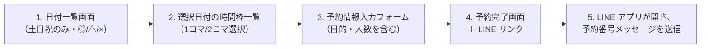
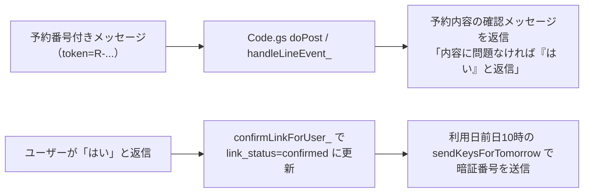

# 学びのかまくら 予約システム（Apps Script）設計書

## 1. 概要（Purpose）

本ドキュメントは、「学びのかまくら」レンタルスペースのために構築した **予約＋LINE連携システム** の実装仕様をまとめたものです。  
ユーザーは Web 予約フォームから「日付 → 時間帯 → 利用目的・人数など」を入力して予約します。  
予約が完了すると Google カレンダーに予定が登録され、さらに公式LINEで予約番号を送ることで、LINEアカウントと予約を紐づけます。  
利用日前日の 10:00 に、自動的に暗証番号を LINE へ送信します。

---

## 2. 要件（Requirements）

### 2.1 機能要件

| ID   | 機能名                        | 内容                                                                                 |
| ---- | ----------------------------- | ------------------------------------------------------------------------------------ |
| F-01 | 予約枠の可視化                | 土日祝のみを対象に、日付ごとに「◎ / △ / ×」の空き状況を月単位で表示する             |
| F-02 | 日付選択 → 時間枠表示         | 日付をクリックすると、その日の空き枠（1コマ/2コマ）を表示する                       |
| F-03 | 予約情報入力                  | 名前・メール・利用目的・利用人数・利用規約同意・公式LINE登録確認をフォームで取得   |
| F-04 | カレンダー登録                | 予約確定時に、指定の Google カレンダーへイベントを作成する                           |
| F-05 | 二重予約防止                  | 予約確定時に対象時間帯の既存イベントを確認し、二重予約を防止する                     |
| F-06 | ログ保存                      | 予約情報を Google スプレッドシート `log` シートに行単位で記録する                    |
| F-07 | LINE 予約番号送信リンク       | 予約完了画面から、予約トークン付きの LINE メッセージ作成リンクを表示する             |
| F-08 | LINE と予約の紐づけ           | ユーザーが token をLINEに送信し、内容確認後「はい」と返信することで紐づけを確定     |
| F-09 | 暗証番号自動送信（前日10時）  | 利用日前日の 10:00 に、暗証番号と当日の案内を LINE へ自動送信する                   |
| F-10 | 月末の予約解放制御            | 月末（25日以降）は「今月＋2か月先」まで、通常は「今月＋1か月先」まで予約可能に制御   |

### 2.2 非機能要件

| ID   | 要件         | 内容                                                                              |
| ---- | ------------ | --------------------------------------------------------------------------------- |
| N-01 | 可用性       | Web アプリ URL を共有するだけで利用可能であること                                 |
| N-02 | 認証         | 予約利用者は Google ログイン不要とする（匿名アクセス）                            |
| N-03 | セキュリティ | カレンダー操作は Apps Script オーナー権限で行い、利用者にカレンダー権限を与えない |
| N-04 | 運用性       | Google カレンダーと Spreadsheet から予約の管理・変更ができる                       |
| N-05 | 拡張性       | 他の通知手段や料金体系の変更に対応しやすい構成                                   |

---

## 3. システム構成（Architecture）

```mermaid
flowchart TD
  U[ユーザー<br>Webブラウザ] --> WA[Apps Script Web アプリ (index.html)]
  WA --> GAS[Google Apps Script Backend (Code.gs)]
  GAS --> CAL[Google Calendar<br>（予約用カレンダー）]
  GAS --> SHEET[Google Spreadsheet<br>（log シート）]
  U2[ユーザー<br>LINE] --> LINE[LINE プラットフォーム]
  LINE --> GAS
```

- フロントエンド：Apps Script HTML Service (`index.html`)
- バックエンド：Apps Script (`Code.gs`)
- 外部サービス：
  - Google Calendar（予約用カレンダー）
  - Google Spreadsheet（予約ログ）
  - LINE Messaging API（予約番号送信・暗証番号送信）

---

## 4. 画面フロー（UI Flow）



LINE 側のフロー：



---

## 5. 処理フロー（Backend Flow）

### 5.1 月ごとの空き状況取得 `getAvailability(year, month)`

1. フロントから `google.script.run.getAvailability(year, month)` を呼び出し。
2. `CalendarApp.getCalendarById(CONFIG.CALENDAR_ID)` で予約用カレンダーを取得。
3. 月初〜月末までを1日ずつループし、以下を実施：
   - 営業日判定：`isBusinessDay_(d, isHoliday)`  
     土日または祝日のみ営業日として扱う。
   - 月間イベントは `cal.getEvents(firstDay, rangeEnd)` でまとめて取得し、`eventsByDate[yyyy-MM-dd]` にグルーピング。
   - 祝日カレンダー（`CONFIG.HOLIDAY_CALENDAR_ID`）も同様に月間で取得し、`holidayMap[yyyy-MM-dd] = true` をセット。
   - その日のイベント一覧を元に `countFreeSlotsForDateFromEvents_(d, eventsForDay)` を呼び出し、  
     SLOT_PATTERNS すべてに対して重複判定 `hasOverlap_` を行い、空き枠数/総枠数からステータスを決定：
     - 全枠空き → `"◎"`
     - 一部空き → `"△"`
     - 空きなし → `"×"`
4. 結果を `{date, status, isHoliday}` の配列で返却。  
   同一 year/month の結果は `CacheService.getScriptCache()` で数分（300秒）キャッシュ。

### 5.2 特定日付の空き枠取得 `getSlots(dateStr)`

1. `dateStr`（例：`"2025-11-22"`）を `parseDate_(str)` で `Date` に変換。
2. `cal.getEventsForDay(d)` で当日のイベントを一括取得。
3. `buildFreeSlotsForDateFromEvents_(d, eventsForDay)` で SLOT_PATTERNS に基づき空きスロットのみを抽出。
4. `{start: ISO, end: ISO}` 形式の配列で返却。  
   フロント側ではこれを 1コマ/2コマの商品（SINGLE_OFFERS / DOUBLE_OFFERS）にマップして表示。

### 5.3 予約確定処理 `reserve(data)`

入力 payload 例：

```json
{
  "name": "山田太郎",
  "email": "example@gmail.com",
  "purpose": "親子ワークショップ",
  "peopleCount": 3,
  "lineRegistered": true,
  "agree": true,
  "slots": [
    { "start": "2025-11-22T09:00:00+09:00", "end": "2025-11-22T11:00:00+09:00" }
  ]
}
```

1. 必須チェック：
   - `name`, `email`, `agree`, `slots` が存在すること
   - `purpose` が空でないこと
   - `peopleCount` が数値かつ `> 0`
   - `lineRegistered` が `true`
2. Google カレンダーの取得と、重複予約チェック：
   - `slots` を `Date` に変換し、各スロットに対して `cal.getEvents(s.start, s.end)` を実行。
   - 既存イベントがあればエラー `"すでに予約が埋まりました"` を投げる。
3. 予約トークン・鍵番号生成：
   - `generateToken_()` で `R-YYYYMMDD-ランダム英数字` の形の token を生成。
   - `CONFIG.KEY_CODE` から固定鍵番号を取得。
4. カレンダー登録：
   - 各スロットに対して `cal.createEvent("予約: 名前", start, end, options)` を呼び出し。
   - `description` には `名前 / メール / 鍵番号 / トークン` を記録。
   - `guests` にメールアドレス、`sendInvites: true` で招待メール送信。
5. ログ書き込み（Spreadsheet `log` シート）：
   - `CONFIG.SHEET_ID` が設定されている場合のみ書き込み。
   - シート構造（1行分）：

     | 列 | 名前         | 内容                                  |
     | -- | ------------ | ------------------------------------- |
     | 1  | timestamp    | ログ記録時刻                          |
     | 2  | start        | 予約開始日時                          |
     | 3  | end          | 予約終了日時                          |
     | 4  | name         | 利用者名                              |
     | 5  | email        | メールアドレス                        |
     | 6  | agree        | 利用規約同意フラグ（true/false）      |
     | 7  | token        | 予約トークン                          |
     | 8  | keyCode      | 鍵番号                                |
     | 9  | line_user_id | LINE ユーザーID（紐づけ後にセット）   |
     | 10 | purpose      | 利用目的（フォーム入力）              |
     | 11 | people_count | 利用人数（フォーム入力）              |
     | 12 | link_status  | `"pending"` / `"confirmed"` / 空      |
     | 13 | link_updated_at | link_status 更新日時              |
     | 14 | key_sent_at  | 暗証番号送信日時（前日送信後にセット）|

6. フロントへ `{ok: true, token}` を返却。  
   フロント側は token を LINE 連携リンクに埋め込む。

### 5.4 LINE Webhook 処理 `doPost(e) / handleLineEvent_(event)`

1. LINE Messaging API からの Webhook を `doPost(e)` で受信。
   - `e.postData.contents` を JSON パースし、`events` 配列を `handleLineEvent_` に渡す。
2. `handleLineEvent_(event)` のメインロジック：
   - `event.type === "message"` かつ `text` メッセージのみ対象。
   - まず、テキストが `"はい"` の場合：
     - `confirmLinkForUser_(userId)` を呼び出し、pending 予約を `confirmed` に更新。
   - それ以外のテキストから予約トークンを抽出：
     - `token=R-YYYYMMDD-XXXXXX` 形式 または `R-YYYYMMDD-XXXXXX` 単体を正規表現で抽出。
     - 見つかれば `linkTokenAndSendKey_(userId, token)` を呼び出し。
   - token でも「はい」でもない場合は、何も返信しない（個別対応用）。

### 5.5 LINE と予約の紐づけ `linkTokenAndSendKey_(userId, token)`

1. `log` シートから token 一致行をすべて取得。
2. 予約が1件もなければ「予約情報が見つかりませんでした」と返信。
3. 別の LINE アカウントとの紐づけチェック：
   - 行の `line_user_id` が空でなく、かつ `!== userId` のものがあれば、
     - 「この予約番号は、すでに別のLINEアカウントと紐づけられています…」と返信し処理終了。
4. すでにこの userId で `link_status === "confirmed"` の行があるか判定：
   - あれば `alreadyConfirmedForThisUser = true`。
5. `alreadyConfirmedForThisUser` が false の場合：
   - 該当行すべてに対して：
     - `line_user_id = userId`
     - `link_status = "pending"`
     - `link_updated_at = now`
6. 代表行（最初の行）から予約サマリを組み立て：
   - 日付・時間帯（複数枠の場合は最小開始〜最大終了）
   - 名前
   - 利用人数
   - 利用目的
   - 「2週間前以降はキャンセル不可（キャンセル料100%）」の注意書き
7. 返信メッセージ：
   - すでに confirmed の場合：
     - 「あなたのLINEアカウントがご予約者様と認識しています」としたうえで予約内容を表示し、  
       暗証番号は前日10時に送る旨を案内。
   - pending（または初回）の場合：
     - 「この予約をこちらのLINEアカウント本人で間違いないか」確認し、  
       問題なければ「はい」と返信するよう促す。

### 5.6 紐づけ確定 `confirmLinkForUser_(userId)`

1. `log` シートから `line_user_id === userId` かつ `link_status === "pending"` の行をすべて取得。
2. 対象行がなければ「紐づけ待ちの予約が見つかりませんでした」と返信。
3. 対象行すべてに対して：
   - `link_status = "confirmed"`
   - `link_updated_at = now`
4. 「ご予約ありがとうございます。このLINEに鍵番号と当日のご案内をお送りします。暗証番号はご利用日前日10時を予定しています。」と返信。

### 5.7 暗証番号送信（前日10時）`sendKeysForTomorrow()`

1. 時間主導型トリガーで毎日 10:00 ごろに実行する想定。
2. `log` シート全行をチェックし、以下の条件を満たす行を対象にする：
   - `start` の日付が「明日」
   - `line_user_id` が存在
   - `link_status === "confirmed"`
   - `key_sent_at` が空
3. 同じ token の行はまとめて1通に集約：
   - 最小 `start`〜最大 `end` を予約時間帯として表示。
4. 代表情報（name, purpose, people_count, keyCode）を用いてメッセージ送信：
   - 予約内容（日時／名前／人数／目的）
   - 暗証番号
   - 「2週間前以降キャンセル不可」の注意書き
   - 何かあれば公式LINEへ連絡、利用後は片付け写真送信のお願い
5. 送信した行には `key_sent_at = 新しい Date()` を記録。

---

## 6. フロントエンド実装（index.html）概要

### 6.1 日付・月ナビゲーション

- `currentMonth`：現在表示中の年月（1日固定）。
- `getMaxAllowedMonth()`：
  - 今日の日付が 1〜24日 → 今月＋1か月先まで表示可能。
  - 今日が 25日以降 → 今月＋2か月先まで表示可能。
- 「次の月」ボタン：
  - `next = currentMonth + 1ヶ月` が `getMaxAllowedMonth()` を超える場合は何もしない。
- 「前の月」ボタン：制限なし（過去月も表示可能だが、過去日付は disabled）。

### 6.2 日付一覧表示 `loadCurrentMonth() / renderCurrentMonth(list)`

- `getAvailability(year, month)` の結果（`[{date, status, isHoliday}]`）を受け取り、  
  `#dates` グリッドにカードとして表示。
- 土日祝のみを営業日としてカードを生成し、
  - `◎` → 緑丸
  - `△` → オレンジ三角
  - `×` → 赤いバツ
- 過去日や `×`（空きなし）は `disabled` クラスで選択不可。

### 6.3 スロット表示と選択ロジック

- `BASE_BLOCKS`：A〜D の 2時間ブロック定義。
- `SINGLE_OFFERS`：A/B/C/D の1コマ（2時間）枠。
- `DOUBLE_OFFERS`：AB/CD の2コマ（4時間）枠。
- `buildOffersFromSlots(slots)`：バックエンドから受け取った `{start,end}` を、  
  BASE_BLOCKS と OFFERS にマッピングして「予約可能な商品」として整形。
- `toggleSlotSelection(dateStr, offer, element)`：
  - 異なる日付が選択された場合は選択状態をリセット。
  - 1コマ選択時：重なっている2コマ選択を自動で解除。
  - 2コマ選択時：重なっている1コマ選択を自動で解除。
  - `normalizeDoubleSelections` により、AとBの2つの1コマ選択が揃った場合に自動で AB 2コマにまとめる。

### 6.4 予約情報入力フォーム

`renderSelectionForm()` で以下のフォームを描画：

- 日付・曜日・選択中の時間帯一覧
- 合計金額、1コマ/2コマの内訳
- 入力項目：
  - 名前（必須）
  - メールアドレス（必須／簡易フォーマットチェック）
  - 利用目的（必須）
  - 利用人数（必須／1以上の数値）
  - 利用規約への同意チェック（`#agree`）
    - 利用規約モーダル（`内容を表示`）＋外部リンク（`利用規約`）付き
    - 初期状態ではチェックボックスは `disabled`。  
      `openTermsModal()`（モーダル表示）時に `agree.disabled = false` とし、  
      一度内容表示を開かないと同意にチェックできないようにしている。
  - 公式LINE登録確認チェック（`#lineRegistered`）
    - 「公式LINEはこちら」リンク（実際の友だち追加URLをセットする想定）
- 注意書き：
  - 「ご利用日の2週間前以降のキャンセルはできません（キャンセル料100%）。」

### 6.5 利用規約モーダル

- `#termsOverlay` ＋ `#termsModal` による簡易モーダル。
- 中身は `学びのかまくら 利用案内・利用規約` の全文。
- `内容を表示` をクリック → `openTermsModal()` → モーダル表示＋`agree.disabled = false`。
- 「閉じる」ボタンまたはオーバーレイクリックで `closeTermsModal()` を呼び、非表示に戻る。

### 6.6 予約完了画面と LINE リンク

- `reserve()` 成功時、返却された `token` を使って preset メッセージを作成：

  ```text
  【学びのかまくら】レンタルスペース
  鍵番号や当日のご案内をLINEでお届けするための予約番号です。
  このまま送信してください。

  R-YYYYMMDD-XXXXXX
  ```

- `https://line.me/R/oaMessage/<BASIC_ID>/?` に `encodeURIComponent(presetMessage)` を連結し、  
  「LINEで鍵を受け取る」ボタンとして表示。  
  スマホで押すと LINE のトーク画面が開き、そのまま送信すれば予約番号が Bot に届く。

---

## 7. Apps Script 関数一覧とシート操作

| 関数名                         | 用途                                   | 主要な外部リソース           | シート列操作                                     |
| ------------------------------ | -------------------------------------- | ---------------------------- | ------------------------------------------------ |
| `doGet()`                      | Web フロントの表示                     | `index.html`                 | なし                                             |
| `getAvailability(year, month)` | 月別の空き状況（◎/△/×）を返す         | Calendar, Holiday Calendar   | なし（内部キャッシュのみ）                      |
| `getSlots(dateStr)`            | 指定日の空きスロット一覧を返す         | Calendar                     | なし                                             |
| `reserve(data)`                | 予約確定・カレンダー登録・ログ記録     | Calendar, Spreadsheet `log`  | 1行に 14列分を `appendRow`                      |
| `doPost(e)`                    | LINE Webhook 入口                      | LINE Messaging API           | なし                                             |
| `handleLineEvent_(event)`      | LINEメッセージ種別（token/はい）判定   | なし                         | なし                                             |
| `linkTokenAndSendKey_(userId, token)` | token と LINE userId を紐づけ、予約内容確認メッセージ送信 | Spreadsheet `log`, LINE | 該当行の 9,12,13列を更新（line_user_id, link_status, link_updated_at） |
| `confirmLinkForUser_(userId)`  | `"はい"` 返信時に紐づけを confirmed に | Spreadsheet `log`, LINE      | 該当行の 12,13列を更新                           |
| `sendKeysForTomorrow()`        | 前日10時に暗証番号＋案内を送信         | Spreadsheet `log`, LINE      | 該当行の 14列（key_sent_at）を更新              |
| `sendLineMessage_(userId,text)`| LINE push メッセージ送信               | LINE Messaging API           | なし                                             |
| `pushTest()`                   | 手動テスト用の固定メッセージ送信       | LINE Messaging API           | なし                                             |

補助関数（カレンダー計算系）：

- `generateToken_()`：トークン生成。
- `isBusinessDay_(d, isHoliday)`：営業日判定（土日 or 祝日）。
- `formatDate_`, `parseDate_`：日付文字列 ⇔ Date。
- `isHolidayCached_`, `getEventsForDayCached_`：祝日／イベント取得のキャッシュ。
- `buildSlotRange_`, `hasOverlap_`, `countFreeSlotsForDateFromEvents_`, `buildFreeSlotsForDateFromEvents_`：スロットとイベントの重なり判定。

---

## 8. エラーハンドリング

### 8.1 サーバー側（Apps Script）

- カレンダー ID 不正 → `CALENDAR_ID が不正か、アクセス権がありません`
- 予約枠の二重予約 → `"すでに予約が埋まりました"`
- 必須項目不足・形式不正 → `reserve` 内で日本語エラーメッセージ
- token から予約が見つからない → `"予約情報が見つかりませんでした"`
- 別の LINE アカウントがすでに紐づいている → `"すでに別のLINEアカウントと紐づけられています"`

### 8.2 クライアント側（HTML）

- 名前／メール／利用目的／人数／利用規約同意／公式LINE登録チェックの入力チェック。
- Apps Script 呼び出し失敗時は failureHandler で alert 表示。

---

## 9. デプロイ・設定手順

1. Apps Script プロジェクトに `Code.gs` / `index.html` を配置。
2. スクリプト プロパティに以下を設定：
   - `CALENDAR_ID`：予約用 Google カレンダーID
   - `SHEET_ID`：ログ用 Spreadsheet のID
   - `KEY_CODE`：暗証番号（固定値）
   - `LINE_ACCESS_TOKEN`：LINE Messaging API のチャネルアクセストークン
   - `LINE_BASIC_ID`：公式LINEのBASIC ID（`@xxxx`）
3. `getAvailability()` などを一度実行して権限を付与。
4. **デプロイ → 新しいデプロイ → Web アプリ**：
   - 実行ユーザー：**自分**
   - アクセス権：**全員（匿名ユーザーを含む）**
5. LINE 側の設定：
   - Messaging API の Webhook URL に、`doPost` を公開している Web アプリ URL を設定。
   - 応答メッセージなどは、必要に応じて LINE 側で OFF/ON を調整。
6. 暗証番号送信用トリガー：
   - 「トリガー」から `sendKeysForTomorrow` を毎日 10:00 実行に設定。

---

## 10. 運用フロー

### 10.1 カレンダー管理

- 予約は Google カレンダーに「予約: 名前」として登録される。
- 日程変更・キャンセルは原則カレンダーとログシートの両方を確認のうえ手動で対応（今後自動化も可能）。

### 10.2 ログシート管理

- `log` シートは予約履歴・LINE紐づけ・鍵送信の状態管理の基盤。
- トラブル時には token で行を検索し、
  - `line_user_id` / `link_status` / `key_sent_at` を確認して状況把握。

### 10.3 LINE 運用

- 通常の問い合わせや「はい」「token」以外のメッセージは、Bot は自動返信しない。  
  → 管理者が個別に公式LINEから対応する前提。

---

## 11. セキュリティ

- カレンダー操作・シート操作は Apps Script オーナー権限で行い、一般ユーザーには権限を与えない。
- Web アプリは URL を知っている人のみアクセス可能。
- LINE 側では、予約番号は `token=R-...` 形式にしており、悪用されにくい形式だが、  
  不審なアクセスが疑われる場合は token のフォーマット変更や期限付き token なども検討可能。

---

## 12. 拡張案（Optional）

- 予約キャンセルフォームと、自動キャンセル処理（2週間前まで無料）。
- メール通知（予約完了、暗証番号通知のバックアップ）。
- 管理者向けダッシュボード（空き状況、売上集計など）。
- 料金体系のバリエーション（平日利用、特別料金日など）。
- reCAPTCHA や rate-limit によるスパム対策。

---

## 13. ファイル構成（Files）

```text
reservation_form_lilili/
├── Code.gs               // Apps Script バックエンド
├── index.html            // フロントエンド（予約フォーム＋JS）
└── reservation_design.md // 本ドキュメント
```
